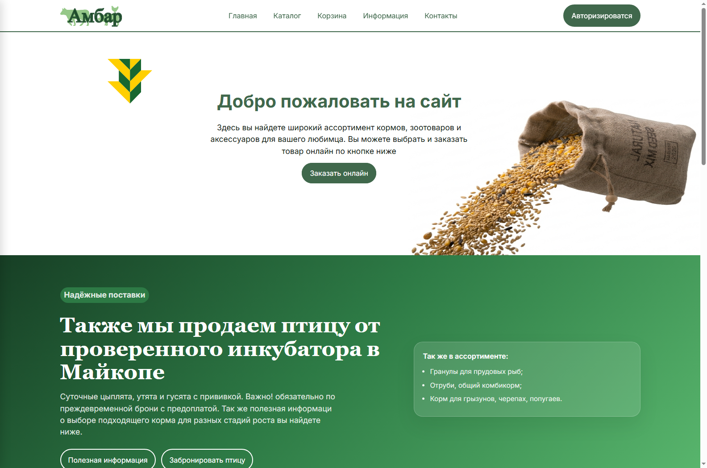
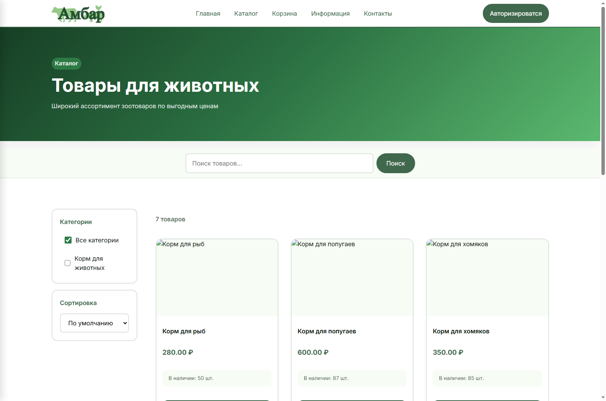
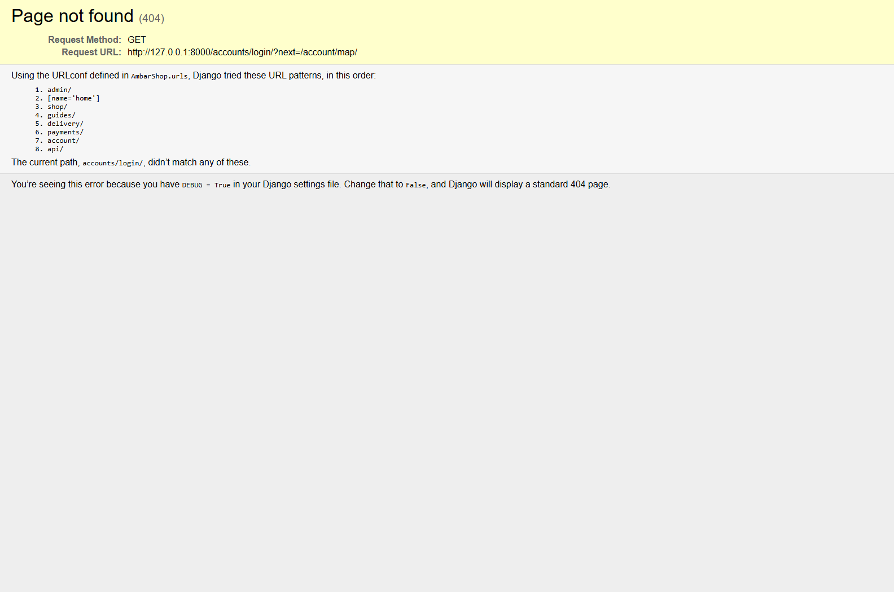
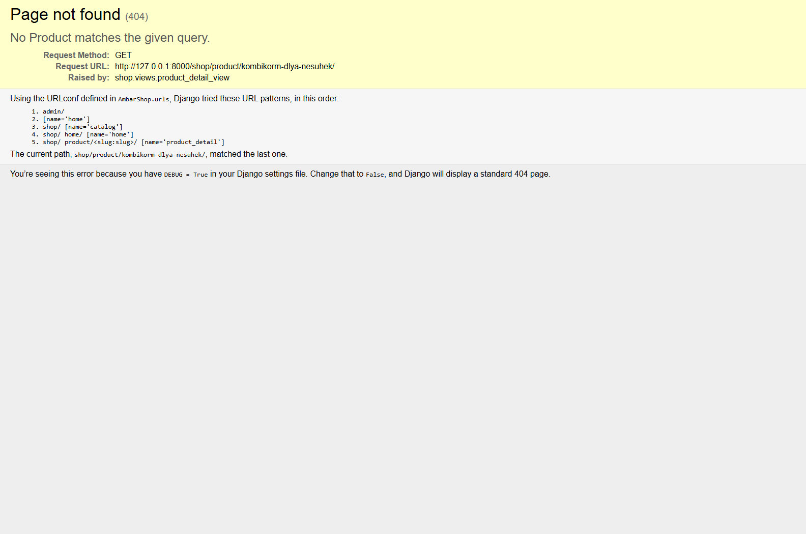

# AmbarShop

## Отчет по практике

**Выполнена в рамках учебной дисциплины ПП.05**

**Разработчик:** Student

**Дата:** 03.07.2026

---

### Содержание

1. [Введение](#введение)
2. [Описание проекта](#описание-проекта)
3. [Архитектура системы](#архитектура-системы)
4. [Основные модули](#основные-модули)
   - [core](#core)
   - [shop](#shop)
   - [guides](#guides)
   - [delivery](#delivery)
   - [payments](#payments)
   - [account](#account)
5. [Технологии](#технологии)
6. [Заключение](#заключение)
7. [Список использованных источников](#список-использованных-источников)

---

## Введение

AmbarShop — это современный интернет-магазин зоотоваров с функционалом онлайн-продаж и доставкой. Проект реализован на фреймворке Django Django 6.0.6 с использованием PostgreSQL в качестве базы данных.

Основные цели проекта:
- Организация онлайн-продаж зоотоваров
- Управление доставкой товаров
- Интеграция с системами оплаты
- Построение интерактивной карты доставки
- Управление отзывами и гайдами

Объем проекта:
- Количество приложений: 6
- Количество моделей: 20
- Количество API endpoints: 9

---

## Описание проекта

**AmbarShop** — это современный интернет-магазин зоотоваров с функционалом онлайн-продаж и доставкой.

### Основные функции

1. **Каталог товаров** - полный каталог зоотоваров с категориями и фильтрацией
2. **Интерактивная карта доставки** - интеграция с Яндекс.Картами для выбора адреса доставки
3. **Система оплаты** - поддержка различных способов оплаты
4. **Управление заказами** - полный цикл обработки заказов
5. **Система отзывов** - оценка товаров и обслуживания
6. **Гайды по уходу** - статьи и советы по уходу за животными
7. **Корзина и закладки** - удобное управление покупками

### Архитектура

Проект построен по модульной архитектуре с разделением на приложения:

- **core** - служебная информация и настройки сайта
- **shop** - товары, категории и каталог
- **guides** - гайды и статьи по уходу
- **delivery** - способы и адреса доставки
- **payments** - платежи и чеки
- **account** - пользователи и учетная запись

Каждое приложение реализует конкретную функциональность и имеет собственные модели, представления и URL-маршруты.

---

## Техническое задание

### Назначение проекта
Создать современный интернет-магазин зоотоваров с удобным каталогом, управлением заказами, системой доставки, оплатой онлайн и личным кабинетом пользователя.

### Основные цели
- Обеспечить удобный выбор и покупку зоотоваров в режиме онлайн
- Организовать работу с доставкой и сохранением адресов клиента
- Реализовать прием платежей и подтверждение заказа
- Предоставить пользователю личный кабинет и возможность просмотра истории заказов
- Внедрить раздел с гайдами и отзывами для повышения доверия клиентов

### Функциональные требования
1. Каталог товаров
   - категории, фильтрация и поиск
   - карточка товара с описанием, изображениями и ценой
   - отображение наличия товара
2. Корзина и оформление заказа
   - добавление товаров в корзину и управление количеством
   - расчет стоимости заказа с учетом доставки
   - выбор способа оплаты и способа доставки
3. Личный кабинет
   - регистрация и вход пользователя
   - просмотр и редактирование профиля
   - сохранение и управление адресами доставки
   - история заказов и статус текущих заказов
4. Система оплаты
   - поддержка нескольких способов оплаты
   - запись платежей и чеков
   - отображение результата оплаты и статуса заказа
5. Доставка
   - поддержка разных методов доставки
   - интеграция с Яндекс.Картами для выбора адреса
   - сохранение адреса доставки пользователя
6. Контент и отзывы
   - раздел с гайдами и статьями по уходу за животными
   - возможность оставлять отзывы на товары
   - публикация отзывов после модерации

### Нефункциональные требования
- Адаптивный интерфейс для настольных и мобильных устройств
- Безопасная авторизация и защита персональных данных
- Удобство пользования и понятная навигация
- Высокая производительность и скорость загрузки страниц
- Масштабируемость и простота расширения функционала

### Ограничения и технологии
- Backend: Django 6.0.6
- База данных: PostgreSQL
- Frontend: HTML, CSS, JavaScript
- API: Django REST Framework
- Статические файлы: CSS, JS, изображения
- Интеграция: Яндекс.Карты для выбора адреса

### Этапы реализации
1. Анализ существующих требований и проектирование архитектуры
2. Проектирование сущностей и базы данных
3. Реализация основных модулей и страниц
4. Настройка API и интеграций
5. Тестирование и отладка
6. Подготовка итоговой документации и отчета

---

## Архитектура системы

### Общая схема

Проект использует классическую three-tier архитектуру:

```
+-------------------------------------------------------------+
|                      Presentation Layer                     |
|                    (Templates & Static)                     |
+-------------------------------------------------------------+
                            |
                            v
+-------------------------------------------------------------+
|                      Business Logic Layer                   |
|                    (Views & Services)                       |
+-------------------------------------------------------------+
                            |
                            v
+-------------------------------------------------------------+
|                       Data Layer                            |
|                   (Database & Models)                       |
+-------------------------------------------------------------+
```

### Модели данных

Основные сущности:
- **User** - пользователи системы (AUTH_USER_MODEL)
- **Category** - категории товаров
- **Product** - товары магазина
- **Order** - заказы
- **Payment** - платежи
- **DeliveryAddress** - адреса доставки
- **Review** - отзывы пользователей
- **Guide** - гайды по уходу

### API архитектура

Для взаимодействия с сервером используется REST API на основе Django REST Framework:

- ViewSets для всех основных сущностей
- JSON-формат данных
- Аутентификация через сессии и токены

---

## Основные модули

### CORE

**Описание:** Основное приложение - служебная информация

**Модели:**
- `SiteInfo`

**Представления (Views):**
- `SiteInfoViewSet`

---

### SHOP

**Описание:** Товары и категории

**Модели:**
- `Category`
- `Product`
- `ProductImage`

**Представления (Views):**
- `CategoryViewSet`
- `ProductViewSet`
- `catalog_view`
- `product_detail_view`
- `home_view`

---

### GUIDES

**Описание:** Гайды по уходу за животными

**Модели:**
- `Guide`
- `GuideImage`
- `Article`
- `ArticleInteraction`

**Представления (Views):**
- `GuideViewSet`
- `GuideImageViewSet`

---

### DELIVERY

**Описание:** Доставка и заказы

**Модели:**
- `DeliveryMethod`
- `DeliveryAddress`

**Представления (Views):**
- `DeliveryMethodViewSet`
- `DeliveryAddressViewSet`

**Особенности:**
- Интеграция с Яндекс.Картами

---

### PAYMENTS

**Описание:** Платежи и чеки

**Модели:**
- `PaymentMethod`
- `Payment`
- `Receipt`

**Представления (Views):**
- `PaymentMethodViewSet`
- `PaymentViewSet`
- `ReceiptViewSet`

---

### ACCOUNT

**Описание:** Управление пользователями

**Модели:**
- `User`
- `UserProfile`
- `Review`
- `Cart`
- `CartItem`
- `Order`
- `OrderItem`

**Представления (Views):**
- `login_view`
- `logout_view`
- `register_view`
- `profile_view`

---

## Технологии

### Основные технологии

| Технология | Версия | Назначение |
|-----------|--------|-----------|
| Python | 3.14 | Язык программирования |
| Django | Django 6.0.6 | Веб-фреймворк |
| PostgreSQL | - | Система управления базами данных |
| Django REST Framework | 3.17.1 | Создание REST API |
| Pillow | 12.2.0 | Обработка изображений |
| Faker | 40.23.0 | Генерация тестовых данных |
| Requests | 2.34.2 | HTTP-запросы |

### Frontend технологии

- **HTML5** - структура страниц
- **CSS3** - стилизация (Bootstrap/Grid)
- **JavaScript** - интерактивность
- **jQuery** - упрощенная работа с DOM

### Инструменты разработки

- **Poetry** - управление зависимостями
- **Git** - контроль версий
- **Postman** - тестирование API

### Интеграции

- **Яндекс.Карты** - интерактивная карта доставки
- **Email** - уведомления (smtp.gmail.com)

---

## Графические материалы

Ниже приведены примеры основных интерфейсов проекта AmbarShop.

### Главная страница



### Каталог товаров



### Выбор адреса на карте



### Страница товара



---

## Заключение

В ходе разработки проекта AmbarShop были реализованы следующие задачи:

1. [OK] Проектирование архитектуры системы
2. [OK] Разработка моделей данных
3. [OK] Реализация REST API
4. [OK] Создание пользовательского интерфейса
5. [OK] Интеграция сторонних сервисов (Яндекс.Карты)
6. [OK] Настройка управления пользовательскими данными
7. [OK] Реализация системы заказов и оплаты

Проект демонстрирует знание современных подходов к разработке веб-приложений, включая:
- Модульную архитектуру
- Принципы DRY (Don't Repeat Yourself)
- REST API проектирование
- Работу с базами данных
- Управление статическими файлами

Дальнейшее развитие проекта может включать:
- Добавление системной администраторской панели
- Интеграцию с внешними платежными системами
- Реализацию поиска с полнотекстовым поиском
- Добавление рекомендательной системы
- Реализацию личного кабинета пользователя

---

## Список использованных источников

1. Документация Django 6.0 - https://docs.djangoproject.com/
2. Документация Django REST Framework - https://www.django-rest-framework.org/
3. Документация Python 3.14 - https://docs.python.org/3/
4. Яндекс.Карты API - https://yandex.ru/dev/maps/
5. PostgreSQL документация - https://www.postgresql.org/docs/
